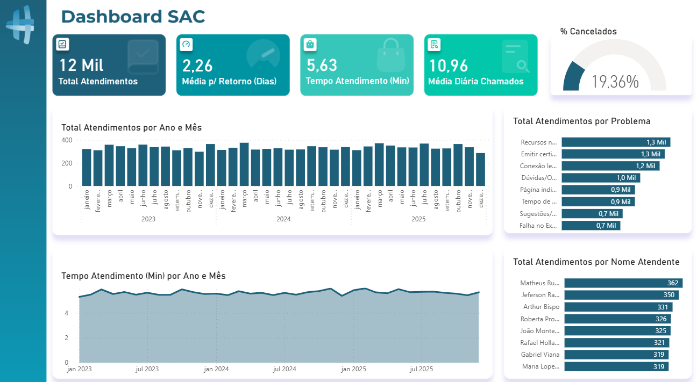

# Dashboard SAC

Dashboard de atendimento ao cliente desenvolvido no Power BI.

## Sobre o projeto

Análise de dados de SAC (Serviço de Atendimento ao Cliente) com dados de 2023 a 2025.

## Métricas analisadas

- Total de atendimentos
- Média de tempo por atendimento (min)
- Média de dias para retorno
- Média diária de chamados
- % de cancelamentos
- Atendimentos por tipo de problema
- Ranking de atendentes

## Ferramentas

## Preview

