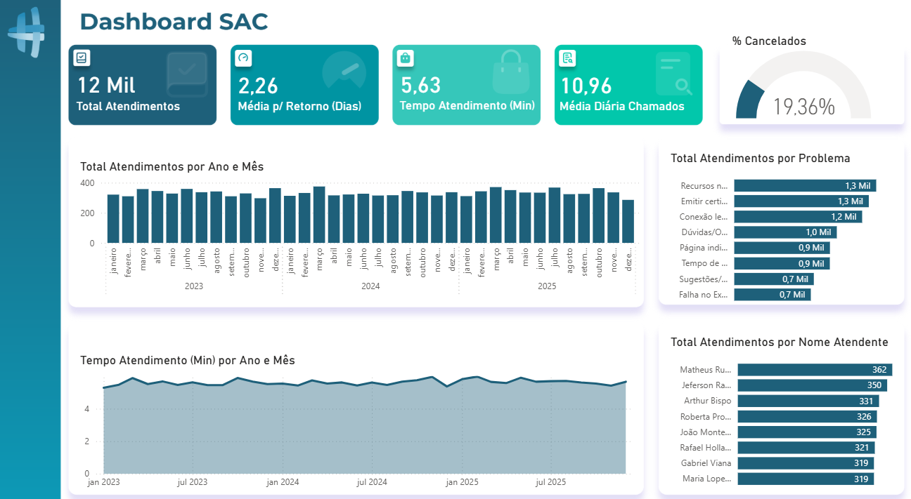

# Dashboard SAC


Dashboard de atendimento ao cliente com dados de **2023 a 2025**,
construído no Power BI para monitorar performance do SAC.

---

## Principais insights

- Total de atendimentos: **12 mil**
- Tempo médio por atendimento: **5,63 minutos**
- Média de dias para retorno: **2,26 dias**
- Média diária de chamados: **10,96**
- Taxa de cancelamento: **19,36%**
- Problema mais frequente: **Recursos** e **Emissão de certificado** (~1,3 mil cada)
- Atendente com mais chamados: **Matheus Ru. (362)**, seguido de Jeferson Ra. (350)
- Volume estável ao longo dos 3 anos, sem mudanças expressiva

---

## Métricas monitoradas

| Métrica | Valor |
|---------|-------|
| Total de atendimentos | 12 mil |
| Tempo médio de atendimento | 5,63 min |
| Média de dias para retorno | 2,26 dias |
| Média diária de chamados | 10,96 |
| % de cancelamentos | 19,36% |

---

## Dashboard



---

## Estrutura

```
dashboard-sac/
├── Relatório SAC.pbix    # Dashboard Power BI
└── dashboard-sac.png     # Preview
```

---

## Tecnologias

| Ferramenta | Uso |
|------------|-----|
| Power BI | Visualização e dashboard |
| Excel | Fonte de dados |

---

Projeto desenvolvido durante estudos na Hashtag Treinamentos.
